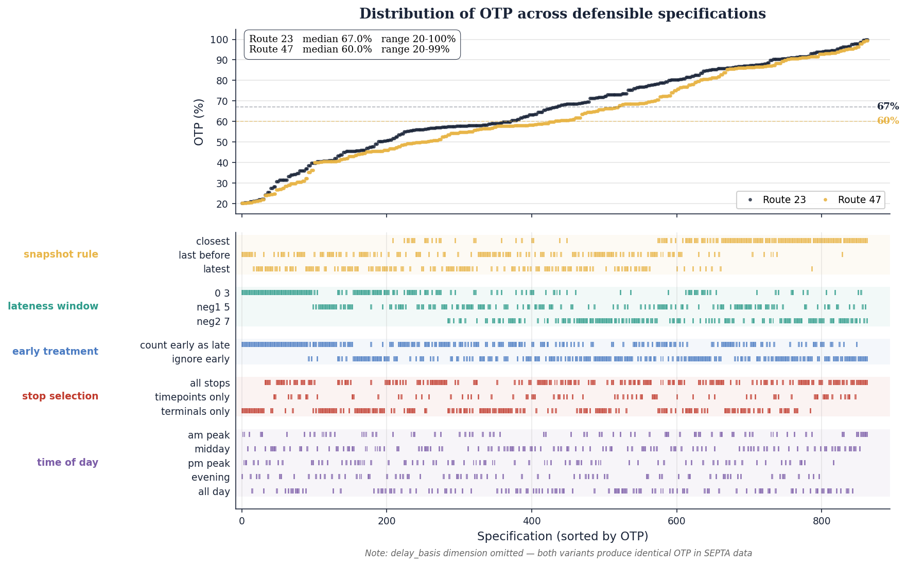

# TransitKPIFramework

A reproducible pipeline for measuring SEPTA bus on-time performance from public real-time data, and a study of how much the reported number depends on the methodological choices behind it.

Across 1,080 defensible specifications on the same data, OTP ranged from 20% to 99%. The largest single source of variation was an upstream pipeline choice that almost no published GTFS-RT analysis discloses.

## Repo

- `septa-archive/`: Dockerized archiver, deployed to a DigitalOcean droplet
- `notebooks/02_parse_gtfsrt.ipynb`: parse protobuf archive into DuckDB
- `notebooks/03_trip_matching.ipynb`: match real-time predictions to scheduled stop events
- `notebooks/04_otp_analysis.ipynb`: specification curve and sensitivity analysis
- `docs/`: paper draft and presentation

## Stack

Python, DuckDB, Docker, LaTeX.

## Contact

Tobi Bussiek · M.S. Computer Science, West Chester University of Pennsylvania (May 2026)
